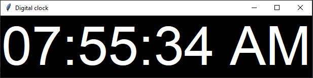

# Digital clock

## Code

A digital clock project in python is a program that displays the current time on a digital interface. The clock can be built using the Python programming language and run on a computer or a Raspberry Pi. The basic functionality of the clock includes displaying the current time, updating the time every second, and allowing the user to adjust the time if necessary.

```python
from tkinter import *
from tkinter.ttk import *
from time import strftime

root = Tk()

root.title("Digital clock")
def clock():
    tick = strftime("%H:%M:%S %p")
    label.config(text =tick)
    label.after(1000, clock)  
label = Label(root, font = ("segoe", 80), foreground = "white", background = "black")
label.pack(anchor= "center")
clock()
mainloop()

```

## Output

